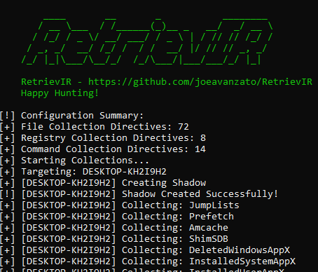
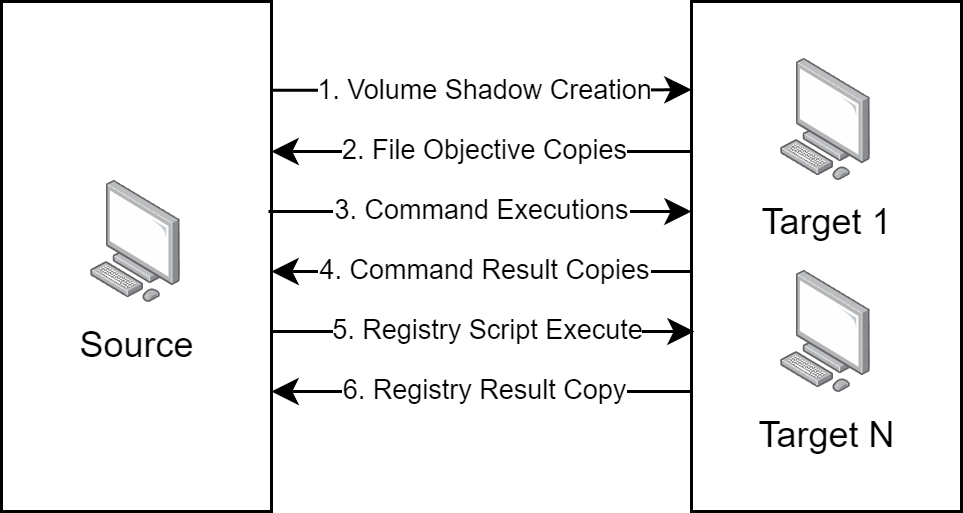

<p align="center">

</p>
<h1 align="center">
Forensic Artifact Retrieval
</h1>

### What is it?

RetrievIR ['Retriever'] is a light-weight PowerShell script built to help Incident Responders gather forensically-useful artifacts from both local and remote hosts.  

The tool is designed to gather as many 'raw' artifacts as possible for easier use in downstream data analysis pipelines.

RetrievIR is also designed to allow for flexible evidence specification via configuration file inputs - collection directives can be one of three forms:
* Files - Specify file paths with filters and whether to check recursively or not.
* Commands - Specify commands to run - commands should output to some type of file and are executed via the PowerShell interpreter.
* Registry - Specify paths with relevant keys to filter on (if any) along with recursiveness.

### Main Features
* Flexible evidence collection based on customizable configuration files.
* Ability to collect files, registry values and command outputs.
* Allows for tagging of evidence-collection objectives for easy specification at run-time.
* Capable of analyzing both local and remote forensic targets.
* Simulation functionality to determine total data size to collect with specified configuration.
* Minimum requirements - WMI and SMB for most capabilities - VSS optional for locked files.
* Evidence Parsing Script - ParseIR - included to generate human/machine-readable information from raw evidence.

### Usage

To use, just download the latest release, unzip and run RetrievIR.ps1 as an administrator - by default, RetrievIR will check for a configs directory in the script's root directory - if it is unable to find this, it will then check for a file named 'config.json' in the same directory.  If it is unable to find either of these and a parameter has not been provided, RetrievIR will exit.

Common commandline parameters are documented below with examples.

```
.\RetrievIR.ps1 : Default Usage - collects all artifacts specified in JSON within 'configs' directory from the localhost into the current directory.

.\RetrievIR.ps1 -tags sans_triage - Capture most artifacts described in the SANS Triage package within KAPE

.\RetrievIR.ps1 -targets HOSTNAME1,HOSTNAME2 : Run RetrievIR against the provided hostnames.

.\RetrievIR.ps1 -target_file C:\targets.txt : Run RetrievIR against the line-delimited targets present in the specified text file.

.\RetrievIR.ps1 -creds : Tell RetrievIR to prompt the user for credentials to use - by default, RetrievIR runs with the current user context.

.\RetrievIR.ps1 -evidence_dir C:\evidence : Tell RetrievIR where to store collected evidence - by default, evidence will be stored in PSScriptRoot\evidence

.\RetrievIR.ps1 -config C:\my_config.json : Specify the path to a custom configuration file to use - by default, RetrievIR will look for all JSON files within the 'configs' directory in PSScriptRoot (current executing directory).

.\RetrievIR.ps1 -config C:\RetrievIRConfigs : Specify the path to a directory containing 1 or more customer configuration JSON to use - by default, RetrievIR will look for all JSON files within the 'configs' directory in PSScriptRoot (current executing directory).

.\RetrievIR.ps1 -categories antivirus,recentfiles : Specify to only collect evidence when the category is within the provided values.

.\RetrievIR.ps1 -categoryscan : List all categories in provided configuration file(s).

.\RetrievIR.ps1 -tags sans_triage : Specify to only collect evidence when the directive contains a provided tag.

.\RetrievIR.ps1 -tagscan : List all tags in provided configuration file(s).

.\RetrievIR.ps1 -simulate : Tells RetrievIR to skip evidence collection and only determine how many files and total size of data that would be collected with specified categories/tags.
```

After collection, to parse evidence, execute 'ParseIR.ps1' - this will check for the default parsing configuration file 'parsing_config.json' in $PSScriptRoot - command-line options for this utility are presented below.

```

.\ParseIR.ps1 -evidence_dir : Path to the collected evidence directory - defaults to $PSScriptRoot\evidence

.\ParseIR.ps1 -parsed_evidence_dir : Where parsed evidence should be stored - defaults to $PSScriptRoot\parsed_evidence

.\ParseIR.ps1 -config example.json : Where to find the parsing configuration file - defaults to $PSScriptRoot\parsing_config.json

.\ParseIR.ps1 -ignoremissing : Tells ParseIR to ignore missing dependencies that are detected.

.\ParseIR.ps1 -utilities_dir : Tells ParseIR where to store/locate third-party dependencies.
```

### What is collected in the default configuration files?

The default configuration files are meant to be more 'complete' repositories of information - these should be trimmed and tailored to meet your teams Incident Response needs - additionally, a 'sans_triage' tag is applied to a select component of objectives - this tag attempts to mimic the standard KAPE SANS Triage artifact collection.

* Jumplists
* Prefetch Files
* Amcache HVE and LOGs
* Scheduled Tasks (Raw XML and formatted CSV)
* PowerShell Console History
* NTUSER.DAT Hives
* AppX Data
  * SYSTEM-installed apps
  * User-installed apps
  * Deleted Apps
  * State Repository
  * Program Data
* Asset Advisor Log
* Windows Drivers
* ShimSDB Files
* SRUDB
* User Access Logging (UAL)
* LNK Files
* Recent File Cache
* NET CLR Usage Logs
* Mini Dump Files
* System Log Files
* MOF Files
* Linux Profile Data
* WDI/WMI Logs
* Office Data
  * Backstage Cache
  * Document Cache
  * Diagnostic Files
  * Autosave Files
* Windows Push Notification DB
* Windows Event Logs
  * Security
  * Application
  * System
  * Task Scheduler Operational
  * PowerShell Operational
  * Shell Core Operational
  * TerminalServices-*
  * RemoteDesktopServices-*
* ProgramCompatAssistant
* BitmapCache
* Windows Timeline (Activites Cache)
* Windows Search Index
* ThumbCache
* USB Setup API Log
* Signature Catalog
* Startup Folders/XML
* Snippet Cache
* IIS Configuration Data
* Group Policy Files
* BITS DB
* Cortana DB
* WBEM Repository
* etc Directory
* Windows 10 Notification DB
* WER Files
* BITS DB/Related Files
* Cortana DB/Related Files
* Antivirus Logs/Artifacts
  * Avast
  * AVG
  * BitDefender
  * Cybereason
  * Cylance
  * Defender
  * ESET
  * F-Secure
  * MalwareBytes
  * McAfee
  * SentinelOne
  * Sophos
  * SUPER
  * Symantec
  * TrendMicro
* Cloud/FileTransfer Logs/Artifacts
  * Box
  * Dropbox
  * FileZilla
  * Google Drive
  * OneDrive
  * SugarSync
  * TeraCopy
* RAT Logs/Artifacts
  * Ammyy Admin
  * AnyDesk
  * Atera
  * Aspera
  * DWAgent
  * Kaseya
  * mRemoteNG
  * OpenSSH
  * OpenVPN
  * ProtonVPN
  * Radmin
  * RealVNC
  * Remote Utilities
  * RustDesk
  * ScreenConnect
  * SplashTop (Atera)
  * Supremo
  * TightVNC
  * TeamViewer
  * UltraVNC
  * UltraViewer
  * ZoHo Assist / GoToMeeting
* Browser Metadata
  * Internet Explorer
  * Edge
  * Chrome
  * Brave
  * Opera
  * Firefox
* DNS Cache
* Windows Services
* TCP Connections
* SMB Shares
* Defender Detections
* Startup Items (Win32_StartupCommand)
* Firewall Rules
* ARP Cache
* "Suspicious" Files
  * Specific extensions in specific paths
* Installed Software
* ActiveScript/CommandLine WMI Consumers
* Running Processes
* USN Journal

### What is parsed in the default configuration files for ParseIR?
* Amcache
* AppCompatCache
* JumpLists
* LNK Files
* Prefetch Files
* RecycleBin Info Files
* RecentFileCache (BCF)
* ShellBags
* SRUM
* User Activity Logging
* ActivitiesCache
* $MFT
* Chrome/Edge User Data
  * Extensions
  * Visits
  * URLs
  * Search Terms
  * Downloads
  * FavIcons
  * OmniboxShortcuts
  * AutoFills

Most artifact parsing is done using the Zimmerman toolset - some custom parsing is also being implemented for other artifacts as required.

### TODO
* $J
* $LogFile
* $SDS
* $Boot
* $T
* ?

### Images

<p align="center">

</p>

<p align="center">

</p>

<p align="center">

</p>

<p align="center">

</p>


### Building Custom Configurations

Configuration files describe forensic evidence to capture from a target endpoint - these files have 3 primary directives that can be used to describe the target data:
1. files
2. commands
3. registry

A configuration file consists of 'directives' which may consist of 1 or more 'objectives' - an objective describes the individual collection task while a directive is the higher level collection of objectives.

#### Files

File Collection Directives are described by 4 primary key attributes in addition to the name of the directive (which is used as the last folder name for evidence storage)
* category [string] - The category of the evidence - file and command based evidence will be grouped by this category.
* filter [array of strings] - Comma-separated filters to use for finding relevantly-named files/extensions - these are each individually run against each path in the specified directive.
* recursive [boolean] - Whether the file search should be recursive in nature.
* paths [array of strings] - The paths to hunt for relevant evidence.

There are a few optional parameters designed to help augment the parsing of evidence as well as collecting 'locked' evidence such as NTUSER.DAT hives, AmCache, etc.
* tags [array of strings] - Specifies tags applied to the objective.
* shadow [boolean] - Specifies whether the evidence must be collected from a newly-created Shadow Copy
* dir_removals [int] - Specifies how many path segments to remove from the front of the path
  * Example: Specifying dir_removal = 5 for a target evidence path such as C:\Users\*\AppData\Local\Apps\* will remove C:, Users, the username, AppData and Local, copying the remaining directory structure of Apps\* into the directive evidence location.
* type [string] - Used in the file export CSV to categorize evidence further.
* parser [string] - Comma-delimited string indicating the names of parsers in parsing_config.json that will be called when scanning collected evidence.

Any evidence path containing the pattern '\Users\*\' will be automatically added into a per-user folder undernear the primary evidence path. 

For example - evidence collected from C:\Users\Joe\Test\Test2\* will be stored at %EVIDENCE_DIRECTORY\%CATEGORY\%DIRECTIVE_NAME\Joe\%EVIDENCE.

An example complete configuration file containing a single file-based directive is shown below:

```
{
	"files": {
        "WinSearchIndex": {
            "category": "Windows"
			"filter": ["*"],
			"recursive": false,
			"paths": [
				"%HOMEDRIVE%\\ProgramData\\Microsoft\\Search\\Data\\Applications\\Windows\\GatherLogs\\SystemIndex\\*"
			]
		}
	}
}
```
This directive will check the specified path for any file with any extension, non-recursively and store all identified files at $EVIDENCE_DIRECTORY\Windows\WinSearchIndex.

```
{
  "files": {
    "Example": [
    {
        "category": "Windows"
        "filter": ["*.log"],
        "recursive": false,
        "paths": [
            "%HOMEDRIVE%\\ProgramData\\Microsoft\\Test\\*"
            
        ],
        "dir_removals": 4
    },
    {
        "category": "Windows"
        "filter": ["*.txt", "*.db"],
        "recursive": true,
        "paths": [
            "%HOMEDRIVE%\\ProgramData\\Example\\*",
            "%HOMEDRIVE%\\ProgramData\\AnotherExample\\*"
        ],
        "shadow": true
    }
    ]
  }
}
```
The example above contains two distinct collection objectives under the same directive - all detected evidence will be stored in the same parent directory, 'Example', but each directive can have varying specifications.

Reviewing the configuration files found inside .\configs will help users to understand the possibilities available in file-based directives.

#### Commands

Command directives are intended to specify commands which should run on the target host and output results to a file which will be transferred back to the machine running RetrievIR.  Command directives contain 3 primary components:

* category [string] - The category of the command, similar to files - this will group evidence at the parent-level directory.
* command [string] - The command to execute - each command must output to a file designated as '#FILEPATH#' - this is replaced dynamically in-line.
* output [string] - The final file name that the resulting evidence will be stored as.

Optional properties:

* tags [array of strings] - Specifies tags applied to the objective.
* type [string] - Used in the file export CSV to categorize evidence further.
* parser [string] - Comma-delimited string indicating the names of parsers in parsing_config.json that will be called when scanning collected evidence.

An example directive is shown below:

```
{
  "commmands": {
    "DNSCache": {
            "category": "Network",
            "command": "Get-NetTcpConnection -ErrorAction SilentlyContinue | Select * | Export-Csv -NoTypeInformation -Path '#FILEPATH#'",
            "output": "DNSCache.csv"
        },
    }
}
```

The directive above will launch the command on all targets and copy the resulting evidence into $EVIDENCE_DIR\Network\DNSCache\DNSCache.csv.

Commands are concatenated together into a single larger script and executed via WMI Process Creation.

Commands can also reference a file such as seen below:

```
"PINGTEST": {
    "category": "test",
    "command": "file:test.ps1",
    "output": "test.csv",
    "tags": ["test"]
}
```
In the above directive, the contents of file 'test.ps1' will be read from the current directory and may be a path such as 'file:C:\test.ps1' - the script should still output to a file as #FILEPATH# internally - this variable will be replaced as appropriate in the script with final output saved as per the 'output' key.

#### Registry

Registry directives collect key/value information from specified paths into a single JSON output file - each directive can contain 5 primary components, described below:

* category [string] - The category of the evidence - this will help group evidence by parent-directory.
* paths [array of strings] - The registry paths to check, in a format such as "HKLM\SOFTWARE\Microsoft\Windows Defender\Exclusions"
* recursive [boolean] - Whether the registry search should be recursive.
* keys [array of strings] - Specifies specific key-names to store instead of storing all key/value pairs in identified registry paths.
* store_empty [boolean] - Specifies whether keys that do not have values should be stored.
* tags [array of strings] - Specifies tags applied to the objective.

An example registry directive is shown below:

```
{
  "registry": {
    "RDPCache": {
      "category": "RDP",
      "paths": ["HKEY_USERS\\*\\SOFTWARE\\Microsoft\\Terminal Server Client\\Servers"],
      "recursive": true,
      "keys": ["UsernameHint"],
      "store_empty": true
    }
  }
}
```

This will identify all paths recursively under the specified path (along with the current) and look for any key-pairs named 'UsernameHint' - any paths with empty values will not be recorded.

Registry directives are bundled into a single large script that is executed on the target host, with all results being stored in a JSON output file having the following example structure:

```
[
  {
    "name":  "RDPCache",
    "category":  "RDP",
    "items":  [
                {
                  "path":  "HKEY_USERS\\S-1-5-21-63485881-451500365-4075260605-1001\\SOFTWARE\\Microsoft\\Terminal Server Client\\Servers\\34.227.81.6",
                  "values":  [
                               {
                                   "type":  "SZ",
                                   "name":  "UsernameHint",
                                   "value":  "MicrosoftAccount\\Administrator"
                               }
                             ]
                }
              ]
  }
]
```

### ParseIR

ParseIR is designed to automate the processing of raw evidence to human/machine readable information for direct importing to a SIEM or other centralized information store.  ParseIR consists of a configuration file which specifies named Parsers - each 'parser' is then invoked either inline when processing collected files, as a standalone mechanism or as a 'native' command invoked through PowerShell.  

When ParseIR runs, it looks for "successful_file_copies.csv" in the root of the collected evidence folder - when evidence is copied, if there is a 'parser' applied in the specific collection directive, this label will be added into the CSV for the relevant files.  As ParseIR reads this CSV, it looks for a parser with the same name - if one is found, replacements are made for either the filename or directory depending on what is specified in the parser's configuration.

An example configuration is shown below:

```
  "MFTECmd":{
    "name": "MFTECmd",
    "evidence_type": "MFT",
    "executable": "MFTECmd.exe",
    "cmdline": "#PARSER# -f #SOURCE_FILE# --csv #DESTINATION_DIR#",
    "url": "https://f001.backblazeb2.com/file/EricZimmermanTools/MFTECmd.zip",
    "dl_type": "zip",
    "if_missing": "download",
    "operates_on": "file",
    "file_filter": ["*"],
    "type": "inline"
  }
```
This parser object will be invoked for any **file** which has an associated parser label that includes 'MFTECmd' - then replacements are made for both the parser exe, the source file and the destination directory and the commandline is invoked.

Additional filters can be applied so that parsers only operate on specifically named files.  

An example of a 'standalone' parser object is shown below:

```
  "ParseBrowserData":{
    "name": "ParseBrowserData",
    "evidence_type": "Browser",
    "executable": "ParseBrowserData.ps1",
    "cmdline": "#PARSER# -base_evidence_dir #EVIDENCE_DIR# -parsed_evidence_dir #PARSED_EVIDENCE_DIR#",
    "url": "N/A",
    "dl_type": "N/A",
    "if_missing": "skip",
    "operates_on": "file",
    "file_filter": ["*"],
    "type": "standalone",
    "output_dir": "Browser"
  }
```

This type of parser is invoked independently of collected files and operates in an independent manner to look for associated evidence to process as appropriate.

A final example of a native command parser is shown below:

```
  "CSVOutputCollector":{
    "name": "CSVOutputCollector",
    "evidence_type": "CommandOutput",
    "executable": "powershell.exe",
    "cmdline": "Copy-Item #SOURCE_FILE# #DESTINATION_DIR#",
    "url": "N/A",
    "dl_type": "N/A",
    "if_missing": "skip",
    "operates_on": "file",
    "file_filter": ["*.csv"],
    "type": "native"
  }
```
This parser is still operated on as records are iterated over but specifies native PowerShell code to run rather than a standalone executable.

Parsers can be downloaded and unpacked automatically based on the specified url, dl_type and if_missing options in each parser object.

### Requirements

* WMI - Used for launching processes / querying data on remote hosts.
* Local Admin Privileges - Required for using WMI remotely, mapping drives, etc.
* SMB - Used for transferring data from remote hosts (Access via Drive Mapping such as \\\TARGET\C$\).
* VSS/ShadowCopies for targeting locked system files - otherwise these will be inaccessible.

### Third-Party Dependencies
* https://system.data.sqlite.org/downloads/1.0.118.0/sqlite-netFx45-binary-x64-2012-1.0.118.0.zip
  * For parsing SQLite databases in PowerShell/.NET - DLL stored at utilities\standalone\System.Data.SQLite.dll
* https://ericzimmerman.github.io/#!index.md
  * Used for parsing various artifacts - downloaded dynamically by ParseIR.ps1 if missing from utilities directory.

### References
* https://github.com/EricZimmerman/KapeFiles/tree/master/Targets
  * General Artifact References
* https://www.sans.org/
  * General Artifact References
* https://github.com/ForensicArtifacts/artifacts
  * General Artifact References
* https://gist.github.com/secabstraction/4044f4aadd3ef21f0ca9
  * For carving MFT in PowerShell
